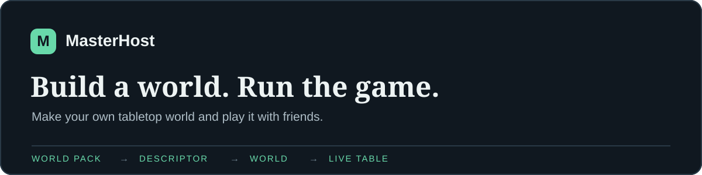

# MasterHost

**Build a world. Run the game.**

MasterHost is a self-hosted toolkit for making tabletop RPG worlds and playing them with friends. Start with a ready setting or build your own rules, places, characters, scenes and visual style. Then open a live table, invite players and keep the game moving with maps, character sheets, dice and a shared journal.

You do not need to write code to make a game. The guided builder uses reusable assets; the advanced editor lets you create and publish a custom World Pack. A finished game can be exported as a `.mhgame` file, and a custom Pack as a `.mhpack` file.

## What you can do

- **Create a world:** choose a setting and compatible assets, make your own choices, or author a Pack from scratch. MasterHost saves the result as a versioned game rather than a temporary setup screen.
- **Run a session:** give players an invitation link or six-digit code. The GM has scenes, maps, notes, encounters and dice at the table; players get a sheet and actions defined by the game's Pack.
- **Share your work:** export a playable game or a reusable Pack as a file. Active campaigns and session history live in PostgreSQL and need a database backup.

Twelve illustrated universes are included as starting points. They are optional: all official Packs are installed together, and choosing one for a new game does not require editing `.env` or restarting the server. Each game has one base Pack and can use compatible assets during creation.

## See it

The [screenshots and World Pack gallery](docs/SHOWCASE.md) shows the current catalog, GM and player tables, and cover art for all twelve included settings. These are actual application captures and packaged illustrations.

<a href="docs/SHOWCASE.md"></a>
<a href="docs/SHOWCASE.md"></a>
<a href="docs/SHOWCASE.md"></a>

You can use these Packs as they are, change the choices in the builder, or make a World Pack of your own.

## Try it locally

You need Docker Engine 24+, Docker Compose v2, about 4 GB of free memory and 5 GB of free disk space.

```bash
cp .env.example .env
```

Set `MASTERHOST_DB_PASSWORD` and `MASTERHOST_ADMIN_TOKEN` in `.env` to two different URL-safe random values. For example, run `openssl rand -hex 32` twice. Then start the application:

```bash
docker compose up --build -d
./scripts/diagnose.sh
```

Open [localhost:8088](http://localhost:8088). Choose **Create a game**, then **Run game** when you are ready to invite players. The [GM and player guide](docs/GAME_GUIDE.md) walks through the first session. See [installation and upgrades](docs/INSTALL.md) for local-network access and upgrades.

## How a game is built

```text
World Pack → Descriptor → compiler → saved World → campaign and live session
```

A World Pack holds the rules and content. The Descriptor records the GM's choices. The compiler turns them into a persistent World. The same runtime reads the resulting Pack for character creation, actions and play; individual universes do not need their own game engine. Saved Worlds retain the exact Pack and Descriptor versions they were built from.

The code lives in [`apps/web`](apps/web) and [`apps/server`](apps/server). The reusable model, compiler, runtime and storage packages are in [`packages`](packages). Bundled settings live in [`worldpacks`](worldpacks); selectable assets and examples are in [`game-assets`](game-assets).

## Project state

MasterHost is a **playtest release**. The world builder, character system and live GM/player tables have automated and local runtime checks. A full game with friends, independent installation, accessibility review and native-language editorial review are still open. The [project status](docs/PROJECT_STATUS.md) records what was tested and what remains.

The code is [source-available under PolyForm Noncommercial 1.0.0](LICENSE). It is not OSI-approved open source. Original bundled content, art and translations have separate CC BY 4.0 terms; see [licenses and attribution](docs/LICENSES.md).

## Work on MasterHost

See [contributing](CONTRIBUTING.md) for setup and test expectations, [security reporting](SECURITY.md) for vulnerabilities, and [operations](docs/OPERATIONS.md) for backups and recovery. Local development uses Node.js 22+ and pnpm 10.17.1:

```bash
./scripts/m0-check.sh
npm exec --yes --package=pnpm@10.17.1 -- pnpm dev
```

The development frontend runs at `http://localhost:5173`; the API runs at `http://localhost:8080`. All installed official Packs remain available. `WORLD_PACK_PATH` changes only the fallback Pack for the default Realm.
