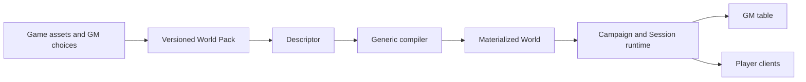

# MasterHost

MasterHost is a self-hosted tabletop RPG engine for preparing and running complete games. A Game Master selects ready assets or uses the advanced visual editor; MasterHost composes a versioned World Pack, builds a Descriptor and materializes a persistent World. Players join with a six-digit code, create Pack-defined Characters and use the same generic engine for maps, dice, actions, encounters, inventory, progression and the shared journal.

The repository is open source under the [MIT License](LICENSE). Bundled original game content and artwork carry their own open-license metadata.

## Start the product

Requirements: Docker Engine 24 or newer with Docker Compose v2, 4 GB free memory, 5 GB free disk and a current browser.

```bash
cp .env.example .env
```

Replace `MASTERHOST_DB_PASSWORD` and `MASTERHOST_ADMIN_TOKEN` in `.env` with two independent URL-safe random values, for example output from `openssl rand -hex 32`. MasterHost refuses to start the product Compose stack when either value is absent.

```bash
docker compose up --build -d
./scripts/diagnose.sh
```

Open [http://localhost:8088](http://localhost:8088). Choose **Create a game** to assemble a game from the asset library, **Run game** to prepare a room, or **Join a game** when you have an invitation code.

Product traffic uses one browser origin: Nginx serves the application and proxies HTTP API and WebSocket traffic to the private API container. PostgreSQL and the API are not published on host ports.

## Guides

- [Installation and upgrades](docs/INSTALL.md)
- [GM and player game guide](docs/GAME_GUIDE.md)
- [Backup, restore and diagnostics](docs/OPERATIONS.md)
- [Licensing and attribution](docs/LICENSES.md)
- [Current milestone evidence](docs/PROJECT_STATUS.md)

## Protect active games

```bash
./scripts/backup.sh
./scripts/restore.sh backups/your-backup.dump --confirm-replace
```

Restore replaces the configured database. Read [Operations and recovery](docs/OPERATIONS.md) before using it. A `.mhgame` file transfers an authored game; a database backup protects Campaigns, Characters, Sessions and play history.

## Build a release archive

```bash
pnpm release -- 0.1.0
node scripts/verify-release.mjs release/masterhost-0.1.0.tar.gz
```

The archive includes source, operator documentation, `VERSION`, a third-party dependency license inventory and SHA-256 manifests. Local environment files, database data, dependencies and build output are excluded.

## Local development

Development requires Node.js 22+, Docker and Corepack or npm. The repository pins pnpm 10.17.1. `scripts/m0-check.sh` starts only the development PostgreSQL service from `compose.dev.yaml`, installs dependencies and runs the baseline checks.

```bash
./scripts/m0-check.sh
npm exec --yes --package=pnpm@10.17.1 -- pnpm dev
```

Open `http://localhost:5173`; the development API is at `http://localhost:8080`. Set `WORLD_PACK_PATH=./worldpacks/<pack-directory>` to run another installed Pack.

Core verification:

```bash
pnpm typecheck
pnpm test
cd apps/web && pnpm build
```

The complete local release engineering gate is `./scripts/m16-release-gate.sh`. It creates and deletes its own isolated Compose project and volume.

## Architecture



Game rules and content live in Packs. The compiler and runtime remain generic, and exact Pack and Descriptor identities are persisted with Worlds so saved games can be reopened and transferred without reconstructing the original UI choices.

## Current product status

M0 through M15 have passed their documented local engineering gates. M16 release engineering and the approved product UX are implemented and locally verified. Full product acceptance still requires a real three-to-four-hour game with one GM and two to five players, human accessibility and localization review, and an explicitly authorized public release. See [M16 status](docs/M16_STATUS.md) for the exact boundary.
