# MasterHost worlds

MasterHost lets a GM build a world and run it at a shared table. The included settings below are starting points; the builder and World Pack format also support original worlds.

[Project overview](../README.md) · [First game guide](GAME_GUIDE.md) · [Pack architecture](../README.md#how-a-game-is-built)

## Included World Packs

Each setting comes with content and illustrations, and can be used as a starting point for a new game. Select an image for its full-size file, or open the Pack directory to inspect its content. The descriptions come from the [universe catalog](../universe-catalog/catalog.json).

<table>
<tr>
<td width="50%"><a href="../game-assets/library/media/classic-fantasy/illustrated-1.4.0/scenes.1.webp">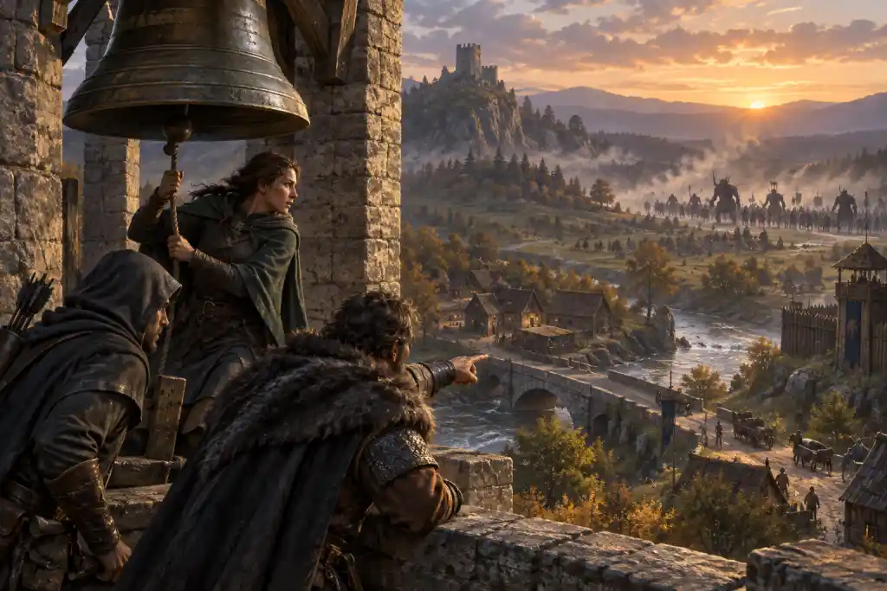</a> <strong><a href="../worldpacks/classic-fantasy">Classic Fantasy</a></strong> Heroic journeys through rival kingdoms, dangerous roads, ancient ruins, and bright fellowship.</td>
<td width="50%"><a href="../game-assets/library/media/dark-fantasy/illustrated-1.2.0/scenes.1.webp">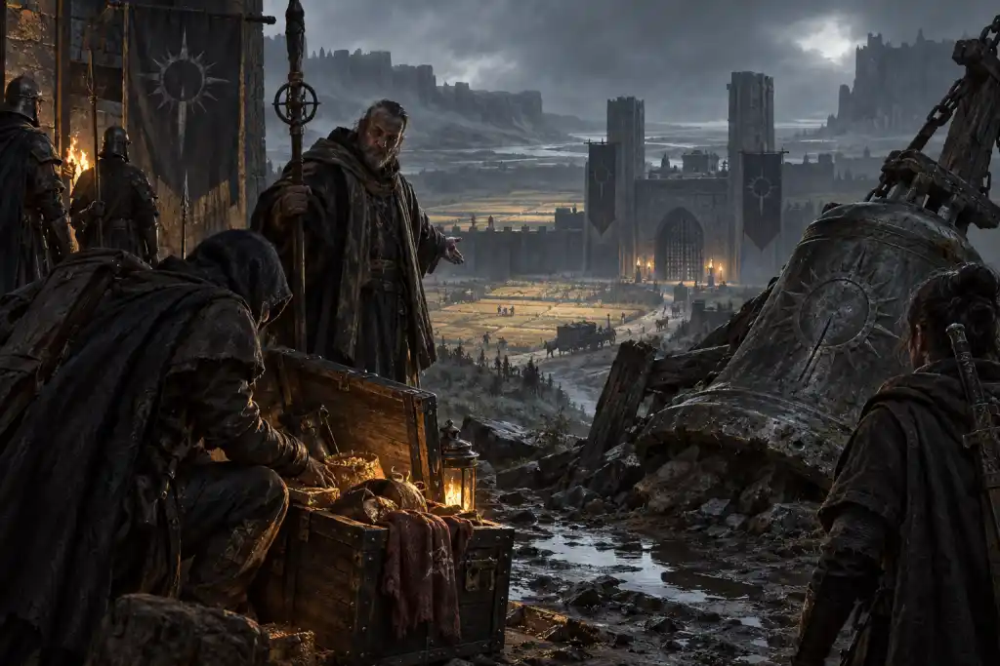</a> <strong><a href="../worldpacks/dark-fantasy">Dark Fantasy</a></strong> Desperate people confront curses, corrupt powers, and choices whose victories always carry a price.</td>
</tr>
<tr>
<td width="50%"><a href="../game-assets/library/media/space-opera/illustrated-1.1.0/scenes.1.webp">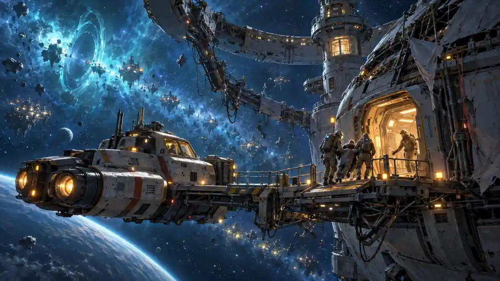</a> <strong><a href="../worldpacks/space-opera">Space Opera</a></strong> A daring crew explores ancient gates, contested systems, and civilizations poised for change.</td>
<td width="50%"><a href="../game-assets/library/media/cyberpunk/illustrated-1.1.0/scenes.1.webp">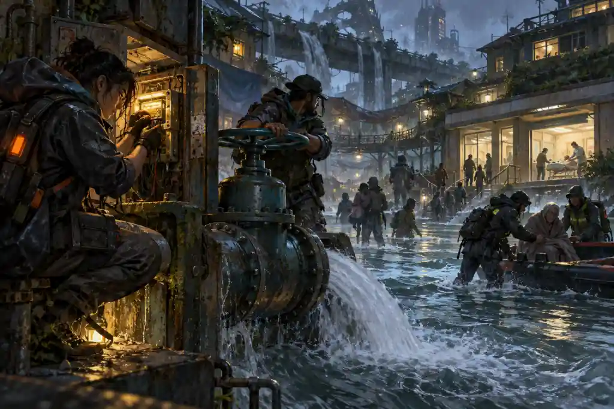</a> <strong><a href="../worldpacks/cyberpunk">Cyberpunk</a></strong> Street crews plan dangerous operations against systems that turn identity, loyalty, and survival into commodities.</td>
</tr>
<tr>
<td width="50%"><a href="../game-assets/library/media/post-apocalypse/illustrated-1.1.0/scenes.1.webp">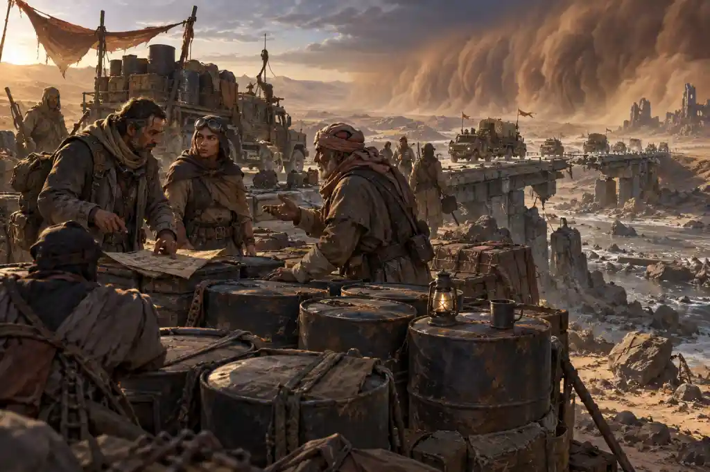</a> <strong><a href="../worldpacks/post-apocalypse">Post-Apocalypse</a></strong> Communities rebuild among ruined roads, scarce resources, strange hazards, and the legacies of a lost age.</td>
<td width="50%"><a href="../game-assets/library/media/gothic-horror/illustrated-1.1.0/scenes.1.webp">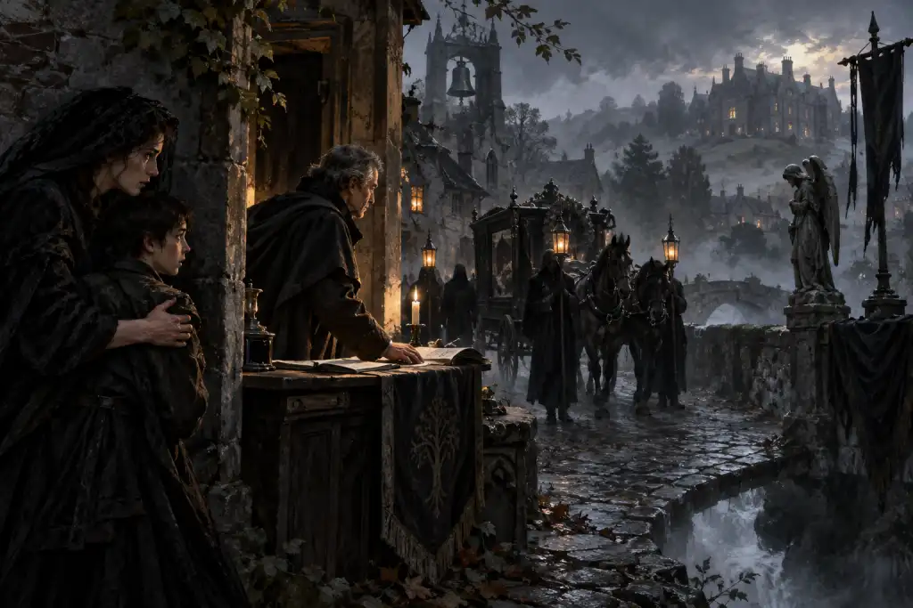</a> <strong><a href="../worldpacks/gothic-horror">Gothic Horror</a></strong> Investigators uncover intimate tragedies, seductive secrets, and monsters hidden behind respectable doors.</td>
</tr>
<tr>
<td width="50%"><a href="../game-assets/library/media/mythic-antiquity/illustrated-1.1.0/scenes.1.webp">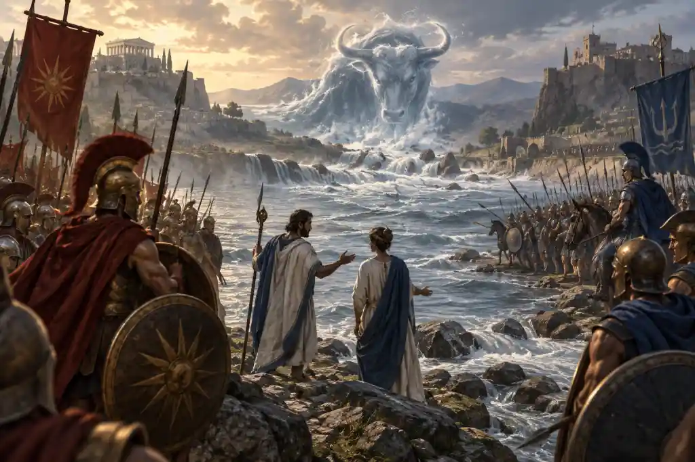</a> <strong><a href="../worldpacks/mythic-antiquity">Mythic Antiquity</a></strong> Heroes face prophecy, divine rivalry, and legendary trials in a world where every deed becomes a story.</td>
<td width="50%"><a href="../game-assets/library/media/weird-west/illustrated-1.1.0/scenes.1.webp">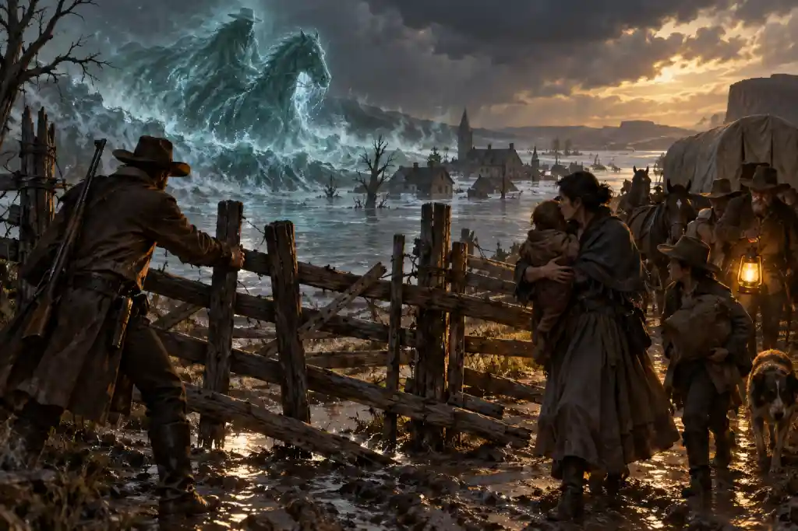</a> <strong><a href="../worldpacks/weird-west">Weird West</a></strong> Drifters, settlers, and outlaws confront supernatural debts across a frontier that remembers every injustice.</td>
</tr>
<tr>
<td width="50%"><a href="../game-assets/library/media/urban-fantasy/illustrated-1.1.0/scenes.1.webp">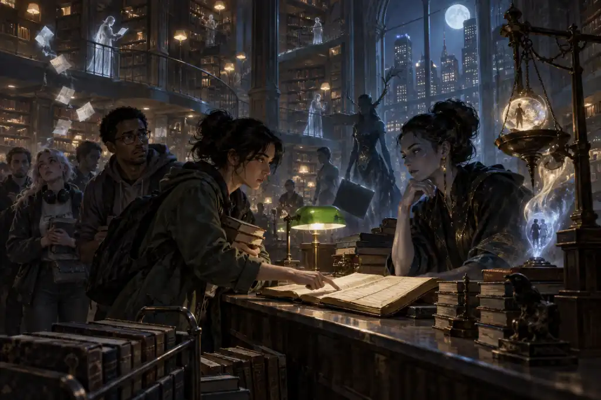</a> <strong><a href="../worldpacks/urban-fantasy">Urban Fantasy</a></strong> Ordinary obligations collide with hidden courts, magical neighborhoods, and bargains that reshape city life.</td>
<td width="50%"><a href="../game-assets/library/media/cosmic-investigation/illustrated-1.1.0/scenes.1.webp">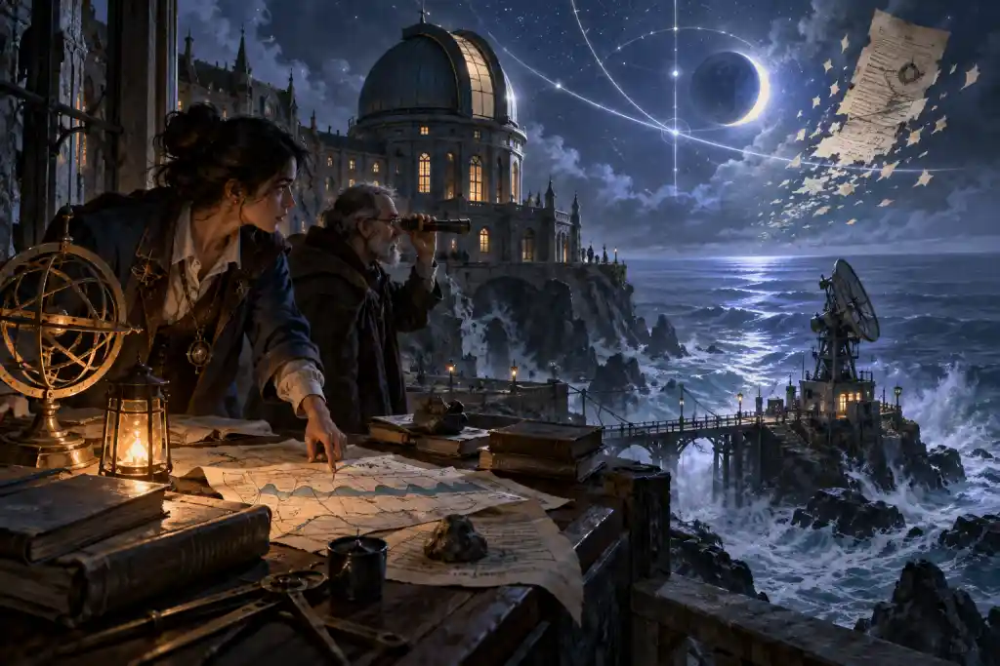</a> <strong><a href="../worldpacks/cosmic-investigation">Cosmic Investigation</a></strong> Investigators pursue impossible evidence while knowledge, isolation, and mounting pressure threaten everyone involved.</td>
</tr>
<tr>
<td width="50%"><a href="../game-assets/library/media/age-of-sail/illustrated-1.1.0/scenes.1.webp">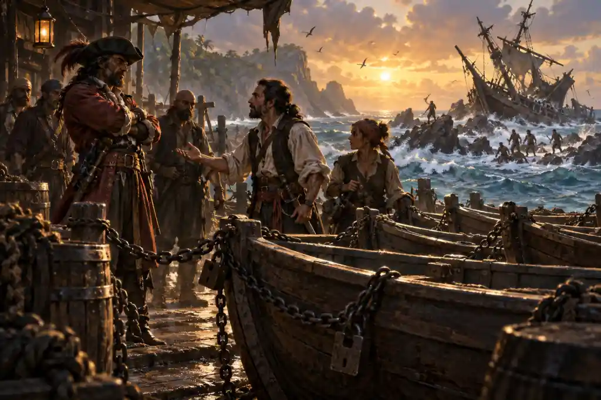</a> <strong><a href="../worldpacks/age-of-sail">Age of Sail</a></strong> Crews chase rumors across dangerous seas where empires, free captains, storms, and living myths compete.</td>
<td width="50%"><a href="../game-assets/library/media/mecha-kaiju/illustrated-1.1.0/scenes.1.webp">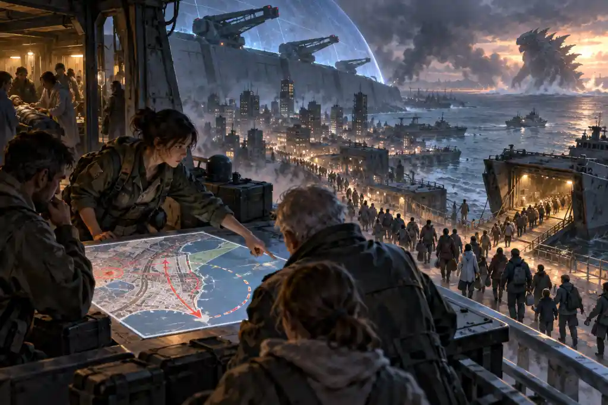</a> <strong><a href="../worldpacks/mecha-kaiju">Mecha & Kaiju</a></strong> Pilots and crews defend fragile communities while immense machines, monsters, and personal bonds bear the cost.</td>
</tr>
</table>

These pictures are from the packaged illustrated collections. See [artwork provenance and review limits](../artwork/README.md) and [licenses and attribution](LICENSES.md).
